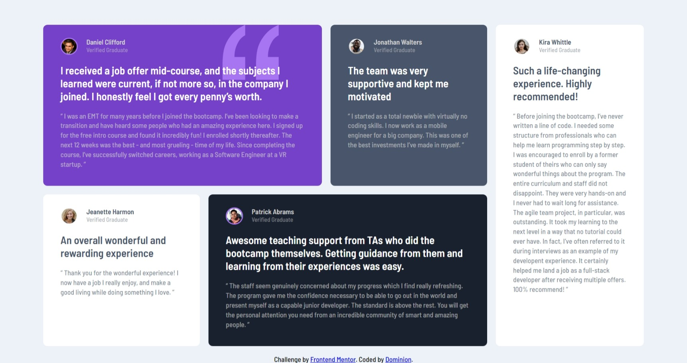
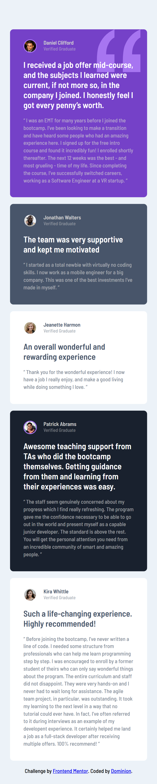

# Frontend Mentor - Testimonials grid section solution

This is a solution to the [Testimonials grid section challenge on Frontend Mentor](https://www.frontendmentor.io/challenges/testimonials-grid-section-Nnw6J7Un7). Frontend Mentor challenges help you improve your coding skills by building realistic projects. 

## Table of contents

- [Overview](#overview)
  - [The challenge](#the-challenge)
  - [Screenshot](#screenshot)
  - [Links](#links)
- [My process](#my-process)
  - [Built with](#built-with)
  - [What I learned](#what-i-learned)
  - [Continued development](#continued-development)
- [Author](#author)

## Overview

### The challenge

Users should be able to:

- View the optimal layout for the site depending on their device's screen size

### Screenshot

### Links

- Solution URL: [https://github.com/why-not-phoenix/testimonials-grid-section](https://github.com/why-not-phoenix/testimonials-grid-section)
- Live Site URL: [https://why-not-phoenix.github.io/testimonials-grid-section/](https://why-not-phoenix.github.io/testimonials-grid-section/)

## My process

### Built with

- Semantic HTML5 markup
- CSS custom properties
- Flexbox
- Mobile-first workflow

### What I learned

This was more challenging than I wanted. I was bent on using Bootstrap at first to improve my skills but I met a dead end. How do you create gaps on Bootstrap without ruining the whole design?
If you have a link of anyone that used bootstrap to complete this challenge it'll be much appreciated.
Anyway, I had to scrap everything and start over w/o Bootstrap. Spent less time, which I guess the idea of Bootstrap is to reduce time spent? maybe cos this is relatively small I won't appreciate that. I guess it came out okay at the end but with minor font issues. Couldn't get the correct font-size.
That's all I have to say for now, criticisms are welcomed.

### Continued development

Bootstrap.
Need to start coding with responsiveness and accessibility in mind.

## Author

- Frontend Mentor - [@why-not-phoenix](https://www.frontendmentor.io/profile/why-not-phoenix)
- Twitter - [@dominion_onoja](https://x.com/dominion_onoja?t=RAWgmHy3YlUySDiPDnZS2g&s=09)